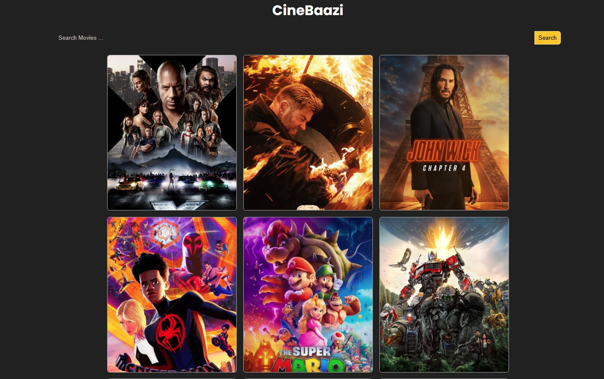

# CineBaazi
CineBaazi is a web application that allows users to search for movies and view details such as title, rating, and overview. The application retrieves movie data from The Movie Database (TMDb) API and displays the results in an interactive and user-friendly interface.

## Screenshot

